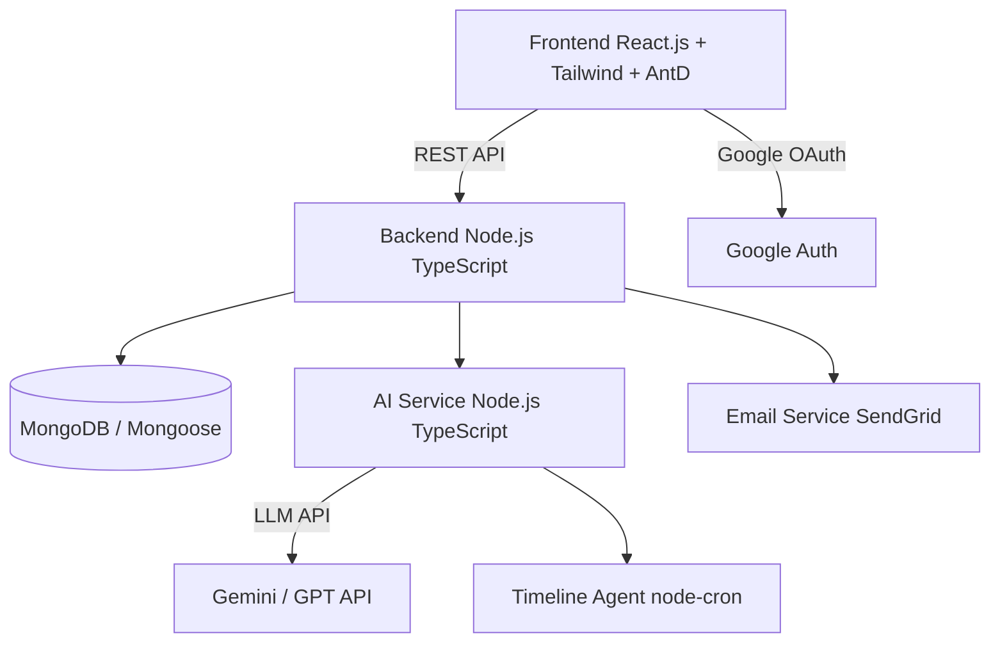

# Sơ đồ Kiến trúc

Thư mục này chứa các sơ đồ kiến trúc và luồng công việc của hệ thống ACMS-AI.

## Các File Dự kiến

| File | Mô tả | Trạng thái |
|---|---|---|
| `architecture.png` | Sơ đồ kiến trúc hệ thống đầy đủ (4 tầng với lớp AI Service) | Sẽ tạo (Tuần 6) |
| `workflow.png` | Sơ đồ luồng cuộc thi đầu cuối (đăng ký → bảng thi → chấm điểm → chung kết) | Sẽ tạo (Tuần 6) |
| `ai_email_flow.png` | Sơ đồ luồng dữ liệu Bộ sinh Email AI | Sẽ tạo (Tuần 7) |
| `ai_question_flow.png` | Sơ đồ pipeline Bộ sinh Câu hỏi từ Bài đánh giá | Sẽ tạo (Tuần 7) |
| `timeline_agent.png` | Sơ đồ luồng Timeline Agent scheduler | Sẽ tạo (Tuần 7) |

## Công cụ Khuyến nghị

- **draw.io (diagrams.net)** — miễn phí, xuất ra PNG
- **Lucidchart** — dành cho sơ đồ chuyên nghiệp
- **PlantUML** — sơ đồ kiến trúc dạng code
- **Mermaid** — sơ đồ nhúng trong Markdown

## Xem nhanh kiến trúc (Mermaid)

